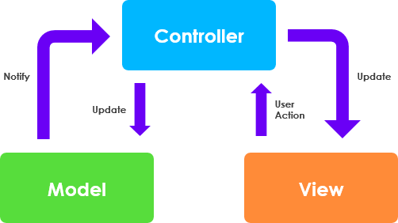

# dokomentation
dette er min egen dokumentation af java Webstack.
Vi skal bruge denne dokumentation til at bedre kunne huske hvad vi lavede.

## Start af et nyt webprojekt

1. Opret nyt projekt i Intellij
2. Vælg JavaEE projektskabelon
3. Java + Maven
4. Servlet dependencies

## Arkitektur

Vi anvender en slags MVC-pattern.

- M(odel) - Entiteter og hjælpe- metoder og klasser. Business-logic
- V(iew) - JSP og frontend (css, boostrap mm)
- C(ontroller) - Servlets

Husk! Ingen kommunikation mellem model og view. gå altid igennem controller.

## Opret GIT repo
'' shell
git init
git add
git commit -m "first commit"
git remote add origin https://github.com/DanyLoyal/Intranet.git
git push -u origin main